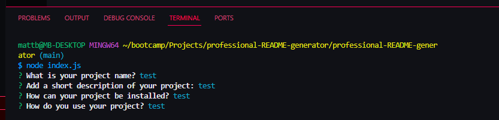

# professional-README-generator

## Description

A node-based README generator that I made.

## Installation

N/A

## Usage

Click this link https://m-beke.github.io/professional-README-generator/ to be taken to the application. 

From there, open the console and run "node index.js". This will prompt you with questions to answer regarding the structure of your README file. Once you have answered all the questions, your unique README file will be generated.

## License

Please refer to the LICENSE in the repo.

